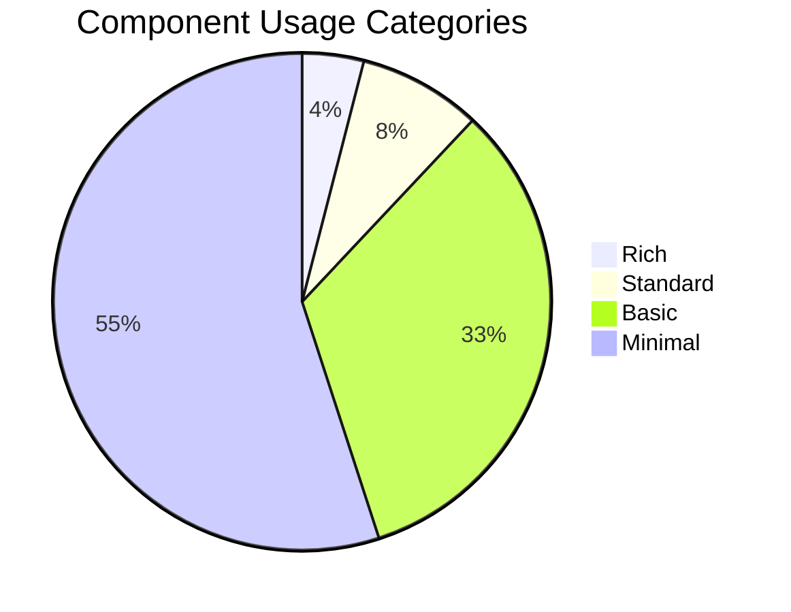
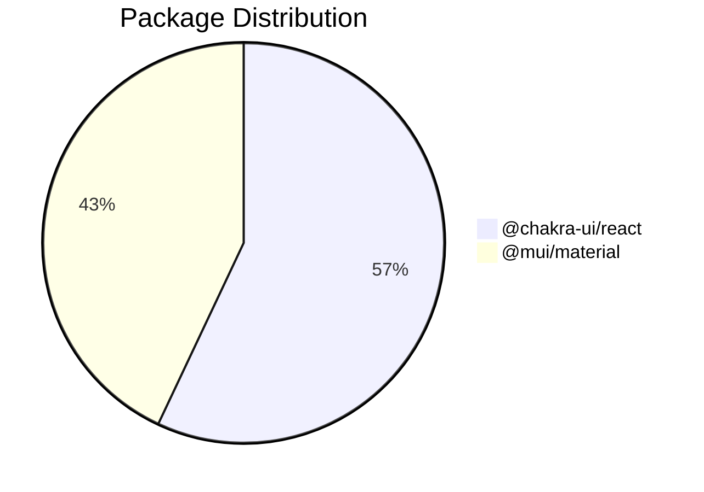

*Navigation: [Home](index.md) | **Components** | [Files](files.md) | [Features](features.md) | [Hubs](hubs.md)*

# Components Report

## Component Usage Dashboard

| **Summary Stats** | **Value** |
|:---------------------|:------------:|
| **Components Analyzed** | **49** |
| **Files Affected** | **39** |
| **Usage Instances** | **194** |

---

[← Back to Main Page](index.md)

## Table of Contents

1. [Executive Summary](#executive-summary)
   - [Components](#components)
   - [Using This Report](#using-this-report)
2. [Component Usage Overview](#component-usage-overview)
   - [Usage Scope](#usage-scope)
   - [Component Usage Categories](#component-usage-categories)
   - [Package Distribution](#package-distribution)
3. [Component Usage Insights](#component-usage-insights)
   - [Components by Feature Level](#components-by-feature-level)
4. [Component Profiles](#component-profiles)
   - [Top Components by Usage](#top-components-by-usage)
5. [Component Prop Patterns](#component-prop-patterns)
   - [Common Prop Combinations](#common-prop-combinations)
   - [Component Flexibility Index](#component-flexibility-index)

## Executive Summary

### Components

This report provides a quantitative analysis of component usage across your codebase, focusing on measurable patterns such as:

- **Component versatility** (how many different ways components are configured)
- **Usage frequency** (how often each component appears)
- **File distribution** (where components are used)
- **Package distribution** (which libraries are most utilized)

The data reveals usage patterns that can help understand the current structure of your component ecosystem, with special attention to how components are configured across different files.

### Using This Report

1. The **Component Usage Overview** provides statistical distribution of component usage
2. The **Component Usage Insights** organizes components by their versatility levels based on configuration patterns
3. The **Component Profiles** highlights components with the highest usage frequencies
4. The **Component Prop Patterns** analyzes specific prop combinations and standardization

> **Note**: This report uses a multi-dimensional scoring system that prioritizes prop set diversity (different ways components are configured) over simple metrics like prop count. This provides a more accurate picture of how components are actually used across your codebase.

## Component Usage Overview

### Usage Scope

| Metric | Value | Description |
|--------|-------|-------------|
| **Total Components** | 49 | Number of unique components identified in the codebase |
| **Total Component Usages** | 194 | Total instances of components being used |
| **Files Analyzed** | 39 | Number of source files containing component usage |
| **Average Usage per Component** | 4.0 | How frequently each component is used on average |

### Component Usage Categories
*(Categorized by usage patterns, prop diversity, and configuration variations)*

| Usage Category | Count | % of Total | Distribution |
|------------------|-------|------------|--------------|
| **Rich (High Versatility)** | 2 | 4% | █                    |
| **Standard (Medium Versatility)** | 4 | 8% | ██                   |
| **Basic (Limited Versatility)** | 16 | 33% | ███████              |
| **Minimal (Single-purpose)** | 27 | 55% | ███████████          |

> **Note**: Component categories are determined by a weighted score that considers:
> * **Prop Set Diversity**: How many different ways the component is configured (highest weight)
> * **File Distribution**: How widely the component is used across files
> * **Usage Frequency**: How often the component appears in the codebase
> * **Prop Count**: How many different props the component accepts
> * **Usage Standardization**: Whether the component follows consistent usage patterns

### Package Distribution

**Top Packages Breakdown:**

| Package | Component Count | % of Total |
|---------|-----------------|------------|
| @chakra-ui/react | 28 | 57% |
| @mui/material | 21 | 43% |

## Component Usage Insights

This section organizes components by their measured usage characteristics.

### Components by Feature Level

Components are grouped into categories based on their versatility and usage patterns. The feature level is determined by a weighted scoring system that prioritizes:

1. **Prop Set Diversity** (highest weight): The number of different prop combinations used with the component. This measures true versatility in usage.
2. **File Distribution**: How many different files use the component, indicating its reach across the codebase.
3. **Usage Frequency**: Raw count of component instances, showing overall adoption.
4. **Prop Count**: The number of different props the component accepts, indicating flexibility.
5. **Usage Standardization**: Whether the component follows consistent usage patterns across files.

This multi-dimensional approach provides a more nuanced view of component usage patterns than simple metrics like prop count alone.

<b>🔴 High Feature Intensity (2 components)</b>

| Component | Package | Usage Count | Files | Props | Variants | Impact Score |
|-----------|---------|-------------|-------|-------|----------|-------------|
| [Box](./components/@chakra-ui_react/Box.md) | @chakra-ui/react | 18 | 12 | 18 | 10 | 6.3 |
| [Box](./components/@mui_material/Box.md) | @mui/material | 14 | 10 | 14 | 8 | 5.3 |

<b>🟠 Medium Feature Intensity (4 components)</b>

| Component | Package | Usage Count | Files | Props | Variants | Impact Score |
|-----------|---------|-------------|-------|-------|----------|-------------|
| [Grid](./components/@mui_material/Grid.md) | @mui/material | 23 | 6 | 8 | 4 | 4.3 |
| [Typography](./components/@mui_material/Typography.md) | @mui/material | 14 | 9 | 7 | 6 | 4.2 |
| [Text](./components/@chakra-ui_react/Text.md) | @chakra-ui/react | 13 | 7 | 6 | 5 | 3.8 |
| [Heading](./components/@chakra-ui_react/Heading.md) | @chakra-ui/react | 7 | 7 | 5 | 5 | 3.2 |

<b>🟡 Low Feature Intensity (16 components)</b>

| Component | Package | Usage Count | Files | Props | Variants | Impact Score |
|-----------|---------|-------------|-------|-------|----------|-------------|
| [Container](./components/@mui_material/Container.md) | @mui/material | 7 | 7 | 3 | 1 | 2.2 |
| [CircularProgress](./components/@mui_material/CircularProgress.md) | @mui/material | 6 | 3 | 1 | 1 | 1.9 |
| [VStack](./components/@chakra-ui_react/VStack.md) | @chakra-ui/react | 6 | 4 | 4 | 2 | 2.4 |
| [Stack](./components/@chakra-ui_react/Stack.md) | @chakra-ui/react | 6 | 3 | 7 | 3 | 2.9 |
| [Flex](./components/@chakra-ui_react/Flex.md) | @chakra-ui/react | 5 | 4 | 4 | 3 | 2.4 |
| [MenuItem](./components/@mui_material/MenuItem.md) | @mui/material | 4 | 2 | 3 | 2 | 1.9 |
| [Paper](./components/@mui_material/Paper.md) | @mui/material | 4 | 5 | 3 | 3 | 2.1 |
| [Avatar](./components/@mui_material/Avatar.md) | @mui/material | 4 | 2 | 3 | 2 | 1.9 |
| [Stack](./components/@mui_material/Stack.md) | @mui/material | 3 | 2 | 3 | 2 | 1.7 |
| [FormControl](./components/@mui_material/FormControl.md) | @mui/material | 3 | 2 | 4 | 2 | 1.8 |
| [InputLabel](./components/@mui_material/InputLabel.md) | @mui/material | 3 | 2 | 2 | 2 | 1.6 |
| [Select](./components/@mui_material/Select.md) | @mui/material | 3 | 2 | 6 | 2 | 2.0 |
| [Button](./components/@mui_material/Button.md) | @mui/material | 3 | 4 | 5 | 3 | 2.1 |
| [Button](./components/@chakra-ui_react/Button.md) | @chakra-ui/react | 3 | 3 | 8 | 3 | 2.4 |
| [ChakraProvider](./components/@chakra-ui_react/ChakraProvider.md) | @chakra-ui/react | 2 | 2 | 2 | 2 | 1.2 |
| [Link](./components/@chakra-ui_react/Link.md) | @chakra-ui/react | 2 | 2 | 3 | 1 | 1.1 |

<b>🟢 Very Low Feature Intensity (27 components)</b>

| Component | Package | Usage Count | Files | Props | Variants | Impact Score |
|-----------|---------|-------------|-------|-------|----------|-------------|
| [Tab](./components/@mui_material/Tab.md) | @mui/material | 6 | 1 | 1 | 1 | 1.9 |
| [CssBaseline](./components/@mui_material/CssBaseline.md) | @mui/material | 4 | 2 | 0 | 0 | 1.2 |
| [Divider](./components/@mui_material/Divider.md) | @mui/material | 4 | 2 | 1 | 1 | 1.5 |
| [TextField](./components/@mui_material/TextField.md) | @mui/material | 2 | 2 | 2 | 1 | 1.0 |
| [useColorModeValue](./components/@chakra-ui_react/useColorModeValue.md) | @chakra-ui/react | 2 | 1 | 0 | 0 | 0.6 |
| [AlertIcon](./components/@chakra-ui_react/AlertIcon.md) | @chakra-ui/react | 2 | 1 | 0 | 0 | 0.6 |
| [Icon](./components/@chakra-ui_react/Icon.md) | @chakra-ui/react | 2 | 1 | 3 | 1 | 1.1 |
| [extendTheme](./components/@chakra-ui_react/extendTheme.md) | @chakra-ui/react | 1 | 1 | 0 | 0 | 0.0 |
| [Tabs](./components/@mui_material/Tabs.md) | @mui/material | 1 | 1 | 4 | 1 | 0.6 |
| [Stat](./components/@chakra-ui_react/Stat.md) | @chakra-ui/react | 1 | 1 | 1 | 1 | 0.3 |
| [StatLabel](./components/@chakra-ui_react/StatLabel.md) | @chakra-ui/react | 1 | 1 | 1 | 1 | 0.3 |
| [StatNumber](./components/@chakra-ui_react/StatNumber.md) | @chakra-ui/react | 1 | 1 | 1 | 1 | 0.3 |
| [StatHelpText](./components/@chakra-ui_react/StatHelpText.md) | @chakra-ui/react | 1 | 1 | 1 | 1 | 0.3 |
| [Container](./components/@chakra-ui_react/Container.md) | @chakra-ui/react | 1 | 1 | 3 | 1 | 0.5 |
| [Center](./components/@chakra-ui_react/Center.md) | @chakra-ui/react | 1 | 1 | 2 | 1 | 0.4 |
| [Alert](./components/@chakra-ui_react/Alert.md) | @chakra-ui/react | 1 | 1 | 2 | 1 | 0.4 |
| [AlertTitle](./components/@chakra-ui_react/AlertTitle.md) | @chakra-ui/react | 1 | 1 | 1 | 1 | 0.3 |
| [AlertDescription](./components/@chakra-ui_react/AlertDescription.md) | @chakra-ui/react | 1 | 1 | 1 | 1 | 0.3 |
| [Card](./components/@chakra-ui_react/Card.md) | @chakra-ui/react | 1 | 1 | 1 | 1 | 0.3 |
| [CardBody](./components/@chakra-ui_react/CardBody.md) | @chakra-ui/react | 1 | 1 | 1 | 1 | 0.3 |
| [CardHeader](./components/@chakra-ui_react/CardHeader.md) | @chakra-ui/react | 1 | 1 | 1 | 1 | 0.3 |
| [Grid](./components/@chakra-ui_react/Grid.md) | @chakra-ui/react | 1 | 1 | 3 | 1 | 0.5 |
| [SimpleGrid](./components/@chakra-ui_react/SimpleGrid.md) | @chakra-ui/react | 1 | 1 | 4 | 1 | 0.6 |
| [List](./components/@mui_material/List.md) | @mui/material | 1 | 1 | 2 | 1 | 0.4 |
| [ListItem](./components/@mui_material/ListItem.md) | @mui/material | 1 | 1 | 2 | 1 | 0.4 |
| [Select](./components/@chakra-ui_react/Select.md) | @chakra-ui/react | 1 | 1 | 2 | 1 | 0.4 |
| [Badge](./components/@mui_material/Badge.md) | @mui/material | 0 | 1 | 0 | 0 | 0.0 |

> **Understanding Feature Levels:**
> - **Rich**: These components show high versatility with many different configurations across files
> - **Standard**: These components have moderate versatility with several distinct usage patterns
> - **Basic**: These components have limited versatility with few configuration variations
> - **Minimal**: These components are used in a single way with minimal configuration options

## Component Profiles

This section presents the most frequently used components in your codebase based on raw usage count.

### Top Components by Usage

The following components have the highest measured usage frequency in your application:

| Component | Package | Usage Count | Files | Props | Usage Score |
|-----------|---------|-------------|-------|-------|-------------|
| [Grid](./components/@mui_material/Grid.md) | @mui/material | 23 | 6 | 8 | 4.3 |
| [Box](./components/@chakra-ui_react/Box.md) | @chakra-ui/react | 18 | 12 | 18 | 6.3 |
| [Box](./components/@mui_material/Box.md) | @mui/material | 14 | 10 | 14 | 5.3 |
| [Typography](./components/@mui_material/Typography.md) | @mui/material | 14 | 9 | 7 | 4.2 |
| [Text](./components/@chakra-ui_react/Text.md) | @chakra-ui/react | 13 | 7 | 6 | 3.8 |
| [Container](./components/@mui_material/Container.md) | @mui/material | 7 | 7 | 3 | 2.2 |
| [Heading](./components/@chakra-ui_react/Heading.md) | @chakra-ui/react | 7 | 7 | 5 | 3.2 |
| [VStack](./components/@chakra-ui_react/VStack.md) | @chakra-ui/react | 6 | 4 | 4 | 2.4 |
| [CircularProgress](./components/@mui_material/CircularProgress.md) | @mui/material | 6 | 3 | 1 | 1.9 |
| [Stack](./components/@chakra-ui_react/Stack.md) | @chakra-ui/react | 6 | 3 | 7 | 2.9 |
| [Tab](./components/@mui_material/Tab.md) | @mui/material | 6 | 1 | 1 | 1.9 |
| [Flex](./components/@chakra-ui_react/Flex.md) | @chakra-ui/react | 5 | 4 | 4 | 2.4 |
| [Paper](./components/@mui_material/Paper.md) | @mui/material | 4 | 5 | 3 | 2.1 |
| [Avatar](./components/@mui_material/Avatar.md) | @mui/material | 4 | 2 | 3 | 1.9 |
| [CssBaseline](./components/@mui_material/CssBaseline.md) | @mui/material | 4 | 2 | 0 | 1.2 |

> **Note**: Usage counts shown here represent static imports and JSX usage identified through code analysis. Dynamic usage patterns or runtime behavior are not captured in these metrics.

## Component Prop Patterns

This section analyzes how components are configured with different prop combinations across your codebase.

### Component Flexibility Index

The flexibility index measures how many different ways a component is configured relative to its total usage. Higher numbers indicate components used with many different prop combinations.

#### Most Flexible Components

The following components are used with the widest variety of prop combinations:

| Component | Package | Unique Prop Sets | Total Usages | Flexibility Index |
|-----------|---------|------------------|--------------|-------------------|
| [Box](./components/@chakra-ui_react/Box.md) | @chakra-ui/react | 10 | 18 | 55.6% |
| [Box](./components/@mui_material/Box.md) | @mui/material | 8 | 14 | 57.1% |
| [Typography](./components/@mui_material/Typography.md) | @mui/material | 6 | 14 | 42.9% |
| [Heading](./components/@chakra-ui_react/Heading.md) | @chakra-ui/react | 5 | 7 | 71.4% |
| [Text](./components/@chakra-ui_react/Text.md) | @chakra-ui/react | 5 | 13 | 38.5% |
| [Grid](./components/@mui_material/Grid.md) | @mui/material | 4 | 23 | 17.4% |
| [Paper](./components/@mui_material/Paper.md) | @mui/material | 3 | 4 | 75.0% |
| [Button](./components/@mui_material/Button.md) | @mui/material | 3 | 3 | 100.0% |
| [Button](./components/@chakra-ui_react/Button.md) | @chakra-ui/react | 3 | 3 | 100.0% |
| [Stack](./components/@chakra-ui_react/Stack.md) | @chakra-ui/react | 3 | 6 | 50.0% |

*Flexibility Index = Percentage of unique prop combinations relative to total usage count*

#### Most Standardized Components 

The following components show the most consistent usage patterns:

| Component | Package | Uses | Variants | Common Props |
|-----------|---------|------|----------|--------------|
| [Container](./components/@mui_material/Container.md) | @mui/material | 7 | 1 | `children, maxWidth, sx` |
| [CircularProgress](./components/@mui_material/CircularProgress.md) | @mui/material | 6 | 1 | `size` |
| [Tab](./components/@mui_material/Tab.md) | @mui/material | 6 | 1 | `label` |
| [Grid](./components/@mui_material/Grid.md) | @mui/material | 23 | 4 | `children, container, item...` |
| [VStack](./components/@chakra-ui_react/VStack.md) | @chakra-ui/react | 6 | 2 | `align, children, spacing` |
| [Text](./components/@chakra-ui_react/Text.md) | @chakra-ui/react | 13 | 5 | `children` |
| [Typography](./components/@mui_material/Typography.md) | @mui/material | 14 | 6 | `children, component, gutterBottom...` |
| [Stack](./components/@chakra-ui_react/Stack.md) | @chakra-ui/react | 6 | 3 | `alignItems, children, direction...` |
| [Box](./components/@chakra-ui_react/Box.md) | @chakra-ui/react | 18 | 10 | `children, p` |
| [Box](./components/@mui_material/Box.md) | @mui/material | 14 | 8 | `children, sx` |

> **Note**: For detailed prop combination patterns for each component, please visit the individual component pages.
> **Understanding these patterns:** Examining how components are configured can reveal opportunities for standardization or indicate where components might be too complex or too versatile for their intended purpose.
