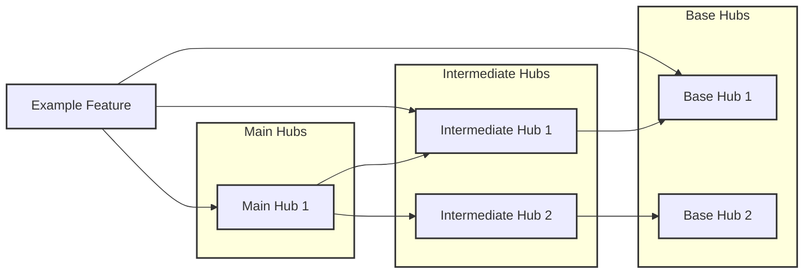

*Navigation: [Home](index.md) | [Components](components.md) | [Files](files.md) | **Features** | [Hubs](hubs.md)*

# Features Overview

Features are the main intersection points where components from different tracked packages are used together.

## How Features Use Hubs

Features build on reusable hubs to create cohesive functionality. This diagram illustrates the typical relationship:

- **Features** use components from different packages to implement complete functionality
- **Main Hubs** are used directly by features, but don't contribute to other hubs
- **Intermediate Hubs** are used by both features and other hubs
- **Base Hubs** are foundational components used by intermediate hubs

**Note:** Currently, we do not separate whether certain hubs are used directly or indirectly by features and other hubs. This means the list reflects all unique hubs used by features.

## Features List

| Feature | Main Hubs | Intermediate Hubs | Base Hubs |
|---------|-----------|-------------------|-----------|
| [AdvancedPanel](./features/AdvancedPanel.md) | - | - | [BaseCard](./hubs/BaseCard.md), [BaseButton](./hubs/BaseButton.md), [IntermediatePanel](./hubs/IntermediatePanel.md) |
| [AnalyticsDashboard](./features/AnalyticsDashboard.md) | - | - | [BaseCard](./hubs/BaseCard.md), [BaseButton](./hubs/BaseButton.md), [IntermediatePanel](./hubs/IntermediatePanel.md) |
| [MainDashboard](./features/MainDashboard.md) | [ManagementHub](./hubs/ManagementHub.md) | [IntermediateForm](./hubs/IntermediateForm.md) | [BaseCard](./hubs/BaseCard.md), [BaseButton](./hubs/BaseButton.md), [IntermediatePanel](./hubs/IntermediatePanel.md) |
| [SettingsPanel](./features/SettingsPanel.md) | [ManagementHub](./hubs/ManagementHub.md) | [IntermediateForm](./hubs/IntermediateForm.md) | [BaseCard](./hubs/BaseCard.md), [BaseButton](./hubs/BaseButton.md), [IntermediatePanel](./hubs/IntermediatePanel.md) |
| [UserSummary](./features/UserSummary.md) | - | - | - |
