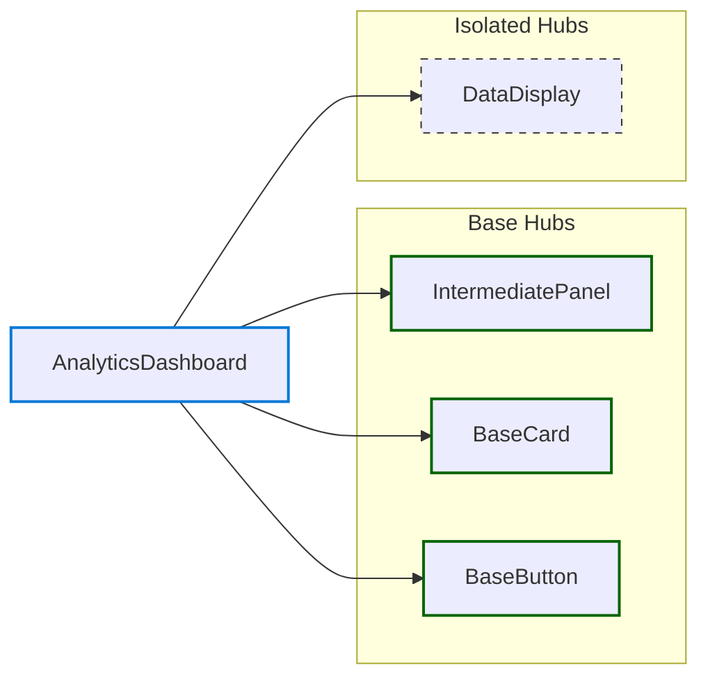

# Feature: AnalyticsDashboard

*Navigation: [Home](../index.md) | [Components](../components.md) | [Files](../files.md) | **Features** | [Hubs](../hubs.md)*

## Feature Overview

- **Path**: [src/components/analytics/AnalyticsDashboard.jsx](https://github.com/star4beam/react-import-analyzer/blob/main/test-project/src/components/analytics/AnalyticsDashboard.jsx)
- **Total Hubs Used**: 4

## Hub Dependencies Diagram

This diagram shows the hub relationships within this feature:

## Hub Dependencies

### Base

| Hub | Used By |
|-----|---------| 
| [BaseCard](../hubs/BaseCard.md) |  |
| [BaseButton](../hubs/BaseButton.md) |  |
| [IntermediatePanel](../hubs/IntermediatePanel.md) |  |

### Isolated Hubs

These hubs are used only within this feature and don't interact with other hubs.

| Hub | Packages |
|-----|----------|
| [DataDisplay](../hubs/DataDisplay.md) | @mui/material, @chakra-ui/react |

## Component Usage

| Package | Components |
|---------|------------|
| @mui/material | [Typography](../components/@mui_material/Typography.md), [Grid](../components/@mui_material/Grid.md), [Paper](../components/@mui_material/Paper.md), [Divider](../components/@mui_material/Divider.md), [Box](../components/@mui_material/Box.md), [Button](../components/@mui_material/Button.md) |
| @chakra-ui/react | [Container](../components/@chakra-ui_react/Container.md), [Box](../components/@chakra-ui_react/Box.md), [Heading](../components/@chakra-ui_react/Heading.md), [Text](../components/@chakra-ui_react/Text.md), [Card](../components/@chakra-ui_react/Card.md), [CardBody](../components/@chakra-ui_react/CardBody.md), [CardHeader](../components/@chakra-ui_react/CardHeader.md), [Button](../components/@chakra-ui_react/Button.md) |

