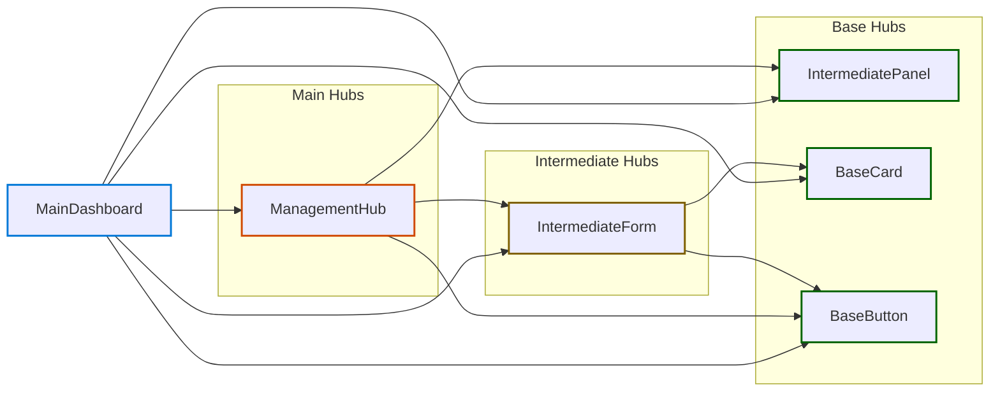

# Feature: MainDashboard

*Navigation: [Home](../index.md) | [Components](../components.md) | [Files](../files.md) | **Features** | [Hubs](../hubs.md)*

## Feature Overview

- **Path**: [src/components/dashboard/MainDashboard.jsx](https://github.com/star4beam/react-import-analyzer/blob/main/test-project/src/components/dashboard/MainDashboard.jsx)
- **Total Hubs Used**: 5

## Hub Dependencies Diagram

This diagram shows the hub relationships within this feature:

## Hub Dependencies

### Main

| Hub | Dependencies |
|-----|-------------|
| [ManagementHub](../hubs/ManagementHub.md) | [IntermediatePanel](../hubs/IntermediatePanel.md), [BaseCard](../hubs/BaseCard.md), [IntermediateForm](../hubs/IntermediateForm.md), [BaseButton](../hubs/BaseButton.md) |

### Intermediate *

| Hub | Used By | Depends On |
|-----|---------|------------|
| [IntermediateForm](../hubs/IntermediateForm.md) | [ManagementHub](../hubs/ManagementHub.md) | [BaseCard](../hubs/BaseCard.md), [BaseButton](../hubs/BaseButton.md) |

### Base

| Hub | Used By |
|-----|---------| 
| [BaseCard](../hubs/BaseCard.md) | [IntermediateForm](../hubs/IntermediateForm.md), [ManagementHub](../hubs/ManagementHub.md) |
| [BaseButton](../hubs/BaseButton.md) | [IntermediateForm](../hubs/IntermediateForm.md), [ManagementHub](../hubs/ManagementHub.md) |
| [IntermediatePanel](../hubs/IntermediatePanel.md) | [ManagementHub](../hubs/ManagementHub.md) |

## Component Usage

| Package | Components |
|---------|------------|
| @mui/material | [Box](../components/@mui_material/Box.md), [Typography](../components/@mui_material/Typography.md), [Paper](../components/@mui_material/Paper.md), [Divider](../components/@mui_material/Divider.md), [TextField](../components/@mui_material/TextField.md), [Box](../components/@mui_material/Box.md), [Button](../components/@mui_material/Button.md) |
| @chakra-ui/react | [SimpleGrid](../components/@chakra-ui_react/SimpleGrid.md), [Container](../components/@chakra-ui_react/Container.md), [Heading](../components/@chakra-ui_react/Heading.md), [Text](../components/@chakra-ui_react/Text.md), [Stack](../components/@chakra-ui_react/Stack.md), [Stack](../components/@chakra-ui_react/Stack.md), [Box](../components/@chakra-ui_react/Box.md), [VStack](../components/@chakra-ui_react/VStack.md), [FormControl](../components/@chakra-ui_react/FormControl.md), [FormLabel](../components/@chakra-ui_react/FormLabel.md), [Card](../components/@chakra-ui_react/Card.md), [CardBody](../components/@chakra-ui_react/CardBody.md), [CardHeader](../components/@chakra-ui_react/CardHeader.md), [Heading](../components/@chakra-ui_react/Heading.md), [Button](../components/@chakra-ui_react/Button.md) |

