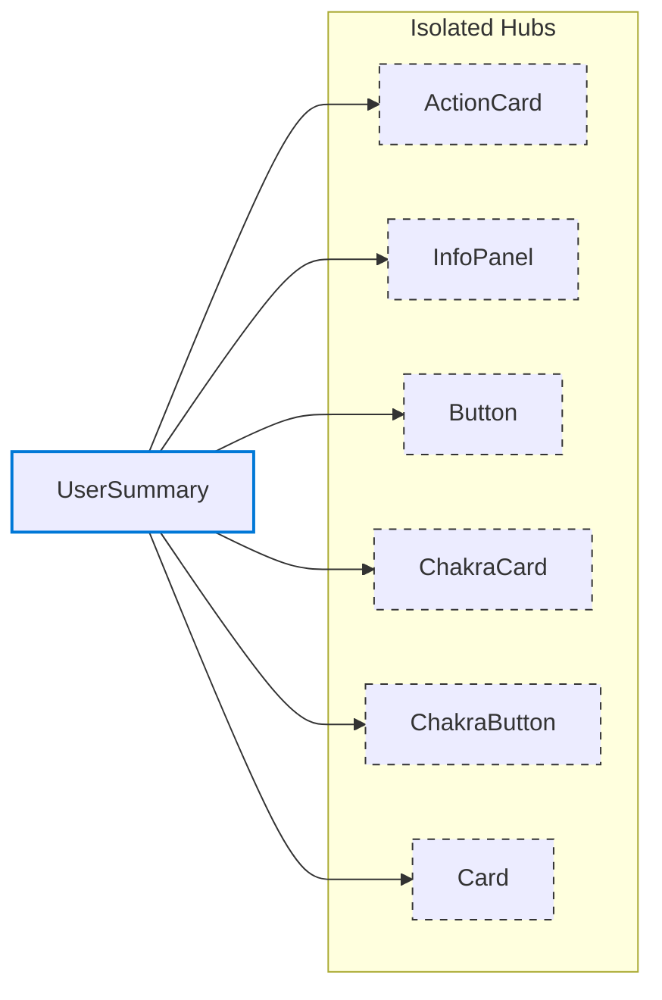

# Feature: UserSummary

*Navigation: [Home](../index.md) | [Components](../components.md) | [Files](../files.md) | **Features** | [Hubs](../hubs.md)*

## Feature Overview

- **Path**: [src/components/dashboard/UserSummary.jsx](https://github.com/star4beam/react-import-analyzer/blob/main/test-project/src/components/dashboard/UserSummary.jsx)
- **Total Hubs Used**: 6

## Hub Dependencies Diagram

This diagram shows the hub relationships within this feature:

## Hub Dependencies

### Isolated Hubs

These hubs are used only within this feature and don't interact with other hubs.

| Hub | Packages |
|-----|----------|
| [ActionCard](../hubs/ActionCard.md) | @mui/material, @chakra-ui/react |
| [InfoPanel](../hubs/InfoPanel.md) | @chakra-ui/react |
| [Button](../hubs/Button.md) | @mui/material |
| [ChakraCard](../hubs/ChakraCard.md) | @chakra-ui/react |
| [ChakraButton](../hubs/ChakraButton.md) | @chakra-ui/react |
| [Card](../hubs/Card.md) | @chakra-ui/react |

## Component Usage

| Package | Components |
|---------|------------|
| @mui/material | [Paper](../components/@mui_material/Paper.md), [Avatar](../components/@mui_material/Avatar.md), [Typography](../components/@mui_material/Typography.md), [Button](../components/@mui_material/Button.md), [styled](../components/@mui_material/styled.md), [Icon](../components/@mui_material/Icon.md) |
| @chakra-ui/react | [Stack](../components/@chakra-ui_react/Stack.md), [Box](../components/@chakra-ui_react/Box.md), [useColorModeValue](../components/@chakra-ui_react/useColorModeValue.md), [Divider](../components/@chakra-ui_react/Divider.md), [Box](../components/@chakra-ui_react/Box.md), [Heading](../components/@chakra-ui_react/Heading.md), [Text](../components/@chakra-ui_react/Text.md), [Button](../components/@chakra-ui_react/Button.md) |

