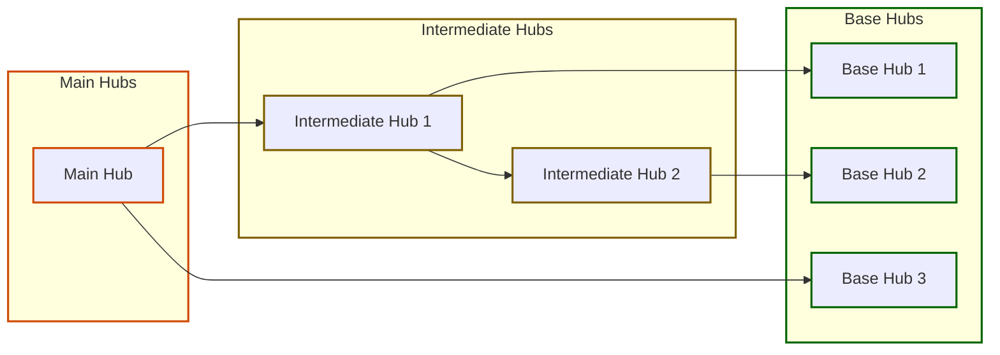

*Navigation: [Home](index.md) | [Components](components.md) | [Files](files.md) | [Features](features.md) | **Hubs***

# Hubs Overview

**Total Hubs Found: 6**

## Hubs

Hubs are intersection points of components that are used by other hubs or features.
In other words, they are the building blocks based on the components of tracked packages.

### Hub Types and Relationships

- **Main Hubs** (0): *Rely on Intermediate and Base hubs but are not utilized by other hubs.*
- **Intermediate Hubs** (0): *Both rely on other hubs and are used by other hubs.*
- **Base Hubs** (0): *Used by other hubs but don't rely on other hubs themselves.*
- **Isolated Hubs** (6): *Used only within their features and don't interact with other hubs.*

Hub dependencies can be:
- **Direct**: The hub directly imports and uses another hub
- **Indirect**: The hub uses another hub through an intermediate hub
- **Both**: The hub both directly and indirectly uses another hub

## Isolated Hubs

These components are used only within their features and don't interact with other hubs:

| Hub | Packages | Feature |
|-----|----------|---------|
| [ActionCard](./hubs/ActionCard.md) | @mui/material, @chakra-ui/react | [UserSummary](./features/UserSummary.md) |
| [Button](./hubs/Button.md) | @mui/material | [UserSummary](./features/UserSummary.md) |
| [Card](./hubs/Card.md) | @chakra-ui/react | [UserSummary](./features/UserSummary.md) |
| [ChakraButton](./hubs/ChakraButton.md) | @chakra-ui/react | [UserSummary](./features/UserSummary.md) |
| [ChakraCard](./hubs/ChakraCard.md) | @chakra-ui/react | [UserSummary](./features/UserSummary.md) |
| [InfoPanel](./hubs/InfoPanel.md) | @chakra-ui/react | [UserSummary](./features/UserSummary.md) |

