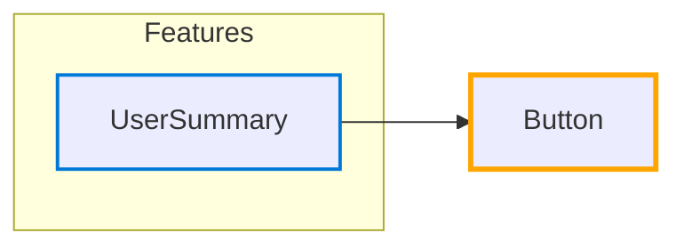

# Hub: Button

*Navigation: [Home](../index.md) | [Components](../components.md) | [Files](../files.md) | [Features](../features.md) | **Hubs***

## Hub Overview

- **Hub Type**: Isolated
- **Path**: [src/components/ui/Button.jsx](https://github.com/star4beam/react-import-analyzer/blob/main/test-project/src/components/ui/Button.jsx)
- **Used by Features**: 1
- **Total Dependency Paths**: 0
- **Packages Used**: @mui/material

## Hub Relationships Diagram

## Features Using This Hub

| Feature | Path |
|---------|------|
| [UserSummary](../features/UserSummary.md) | [src/components/dashboard/UserSummary.jsx](https://github.com/star4beam/react-import-analyzer/blob/main/test-project/src/components/dashboard/UserSummary.jsx) |

## Hubs This Hub Depends On

This hub does not depend on any other hubs.

## Components Used Indirectly

This section shows how components from packages are used by this hub through intermediate files.

| Target Components | Path |
| ---------------- | ---- |
| No intermediate dependencies | No target components |

## Components Used Directly

This section shows the components directly used by this hub from packages.

| Package | Components |
| ------- | ---------- |
| @mui/material | [Button](../components/@mui_material/Button.md) |

