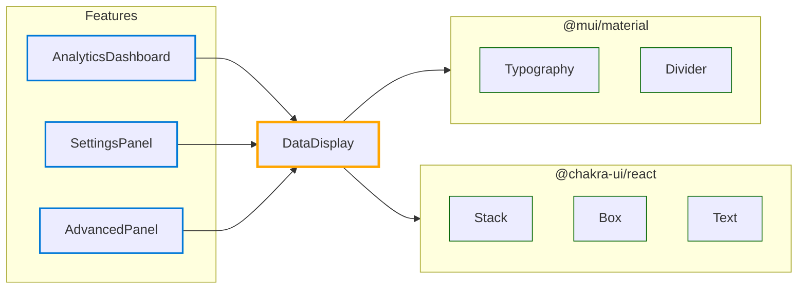

# Hub: DataDisplay

*Navigation: [Home](../index.md) | [Components](../components.md) | [Files](../files.md) | [Features](../features.md) | **Hubs***

## Hub Overview

- **Hub Type**: Isolated
- **Path**: [src/components/common/DataDisplay.jsx](https://github.com/star4beam/react-import-analyzer/blob/main/test-project/src/components/common/DataDisplay.jsx)
- **Used by Features**: 3
- **Total Dependency Paths**: 2
- **Packages Used**: @mui/material, @chakra-ui/react

## Hub Relationships Diagram

## Features Using This Hub

| Feature | Path |
|---------|------|
| [AnalyticsDashboard](../features/AnalyticsDashboard.md) | [src/components/analytics/AnalyticsDashboard.jsx](https://github.com/star4beam/react-import-analyzer/blob/main/test-project/src/components/analytics/AnalyticsDashboard.jsx) |
| [SettingsPanel](../features/SettingsPanel.md) | [src/components/settings/SettingsPanel.jsx](https://github.com/star4beam/react-import-analyzer/blob/main/test-project/src/components/settings/SettingsPanel.jsx) |
| [AdvancedPanel](../features/AdvancedPanel.md) | [src/components/ui/AdvancedPanel.jsx](https://github.com/star4beam/react-import-analyzer/blob/main/test-project/src/components/ui/AdvancedPanel.jsx) |

## Hubs Using This Hub

No other hubs use this hub.

## Hubs This Hub Depends On

This hub does not depend on any other hubs.

## Components Used Indirectly

This section shows components used by other hubs that this hub depends on.

This hub does not use any components indirectly through other hubs.

## Components Used Directly

This section shows the components directly used by this hub from packages.

| Package | Components |
| ------- | ---------- |
| @chakra-ui/react | [Box](../components/@chakra-ui_react/Box.md), [Stack](../components/@chakra-ui_react/Stack.md), [Text](../components/@chakra-ui_react/Text.md) |
| @mui/material | [Divider](../components/@mui_material/Divider.md), [Typography](../components/@mui_material/Typography.md) |

