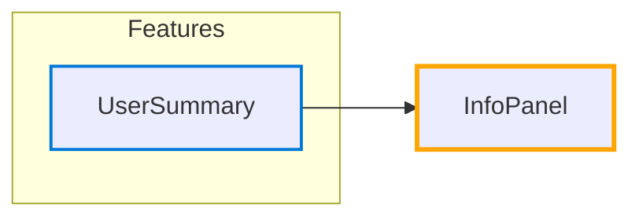

# Hub: InfoPanel

*Navigation: [Home](../index.md) | [Components](../components.md) | [Files](../files.md) | [Features](../features.md) | **Hubs***

## Hub Overview

- **Hub Type**: Isolated
- **Path**: [src/components/common/InfoPanel.jsx](https://github.com/star4beam/react-import-analyzer/blob/main/test-project/src/components/common/InfoPanel.jsx)
- **Used by Features**: 1
- **Total Dependency Paths**: 2
- **Packages Used**: @chakra-ui/react

## Hub Relationships Diagram

## Features Using This Hub

| Feature | Path |
|---------|------|
| [UserSummary](../features/UserSummary.md) | [src/components/dashboard/UserSummary.jsx](https://github.com/star4beam/react-import-analyzer/blob/main/test-project/src/components/dashboard/UserSummary.jsx) |

## Hubs This Hub Depends On

This hub does not depend on any other hubs.

## Components Used Indirectly

This section shows how components from packages are used by this hub through intermediate files.

| Target Components | Path |
| ---------------- | ---- |
| [Box](../components/@chakra-ui_react/Box.md), [Heading](../components/@chakra-ui_react/Heading.md), [Text](../components/@chakra-ui_react/Text.md) (@chakra-ui/react) | [src/components/ui/ChakraCard.jsx](https://github.com/star4beam/react-import-analyzer/blob/main/test-project/src/components/ui/ChakraCard.jsx) |
| [Button](../components/@chakra-ui_react/Button.md) (@chakra-ui/react) | [src/components/ui/ChakraButton.jsx](https://github.com/star4beam/react-import-analyzer/blob/main/test-project/src/components/ui/ChakraButton.jsx) |

## Components Used Directly

This section shows the components directly used by this hub from packages.

| Package | Components |
| ------- | ---------- |
| @chakra-ui/react | [Flex](../components/@chakra-ui_react/Flex.md), [Icon](../components/@chakra-ui_react/Icon.md), [Text](../components/@chakra-ui_react/Text.md) |

