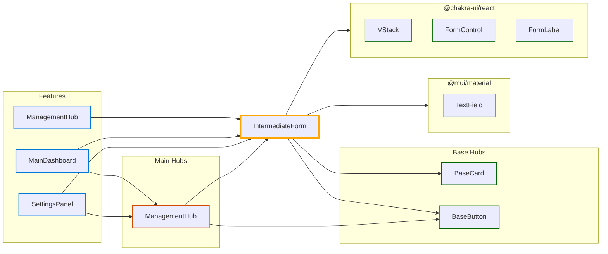

# Hub: IntermediateForm

*Navigation: [Home](../index.md) | [Components](../components.md) | [Files](../files.md) | [Features](../features.md) | **Hubs***

## Hub Overview

- **Hub Type**: Intermediate
- **Path**: [src/components/ui/IntermediateForm.jsx](https://github.com/star4beam/react-import-analyzer/blob/main/test-project/src/components/ui/IntermediateForm.jsx)
- **Used by Features**: 3
- **Total Dependency Paths**: 3
- **Packages Used**: @mui/material, @chakra-ui/react

## Hub Relationships Diagram

## Features Using This Hub

| Feature | Path |
|---------|------|
| [ManagementHub](../features/ManagementHub.md) | [src/components/composite/ManagementHub.jsx](https://github.com/star4beam/react-import-analyzer/blob/main/test-project/src/components/composite/ManagementHub.jsx) |
| [MainDashboard](../features/MainDashboard.md) | [src/components/dashboard/MainDashboard.jsx](https://github.com/star4beam/react-import-analyzer/blob/main/test-project/src/components/dashboard/MainDashboard.jsx) |
| [SettingsPanel](../features/SettingsPanel.md) | [src/components/settings/SettingsPanel.jsx](https://github.com/star4beam/react-import-analyzer/blob/main/test-project/src/components/settings/SettingsPanel.jsx) |

## Hubs Using This Hub

| Hub | Path | Dependency Type |
|-----|------|----------------|
| [ManagementHub](../hubs/ManagementHub.md) | [src/components/composite/ManagementHub.jsx](https://github.com/star4beam/react-import-analyzer/blob/main/test-project/src/components/composite/ManagementHub.jsx) | direct |

## Hubs This Hub Depends On

| Hub | Path | Dependency Type |
|-----|------|----------------|
| [BaseButton](../hubs/BaseButton.md) | [src/components/ui/BaseButton.jsx](https://github.com/star4beam/react-import-analyzer/blob/main/test-project/src/components/ui/BaseButton.jsx) | direct |
| [BaseCard](../hubs/BaseCard.md) | [src/components/ui/BaseCard.jsx](https://github.com/star4beam/react-import-analyzer/blob/main/test-project/src/components/ui/BaseCard.jsx) | direct |

## Components Used Indirectly

This section shows components used by other hubs that this hub depends on.

| Hub | Components Used |
| --- | -------------- |
| [BaseButton](../hubs/BaseButton.md) ([src/components/ui/BaseButton.jsx](https://github.com/star4beam/react-import-analyzer/blob/main/test-project/src/components/ui/BaseButton.jsx)) | [Button](../components/@mui_material/Button.md) (@mui/material) [Button](../components/@chakra-ui_react/Button.md) (@chakra-ui/react) |
| [BaseCard](../hubs/BaseCard.md) ([src/components/ui/BaseCard.jsx](https://github.com/star4beam/react-import-analyzer/blob/main/test-project/src/components/ui/BaseCard.jsx)) | [Box](../components/@mui_material/Box.md), [Paper](../components/@mui_material/Paper.md) (@mui/material) [Card](../components/@chakra-ui_react/Card.md), [CardBody](../components/@chakra-ui_react/CardBody.md), [CardHeader](../components/@chakra-ui_react/CardHeader.md), [Heading](../components/@chakra-ui_react/Heading.md) (@chakra-ui/react) |

## Components Used Directly

This section shows the components directly used by this hub from packages.

| Package | Components |
| ------- | ---------- |
| @chakra-ui/react | [FormControl](../components/@chakra-ui_react/FormControl.md), [FormLabel](../components/@chakra-ui_react/FormLabel.md), [VStack](../components/@chakra-ui_react/VStack.md) |
| @mui/material | [TextField](../components/@mui_material/TextField.md) |

