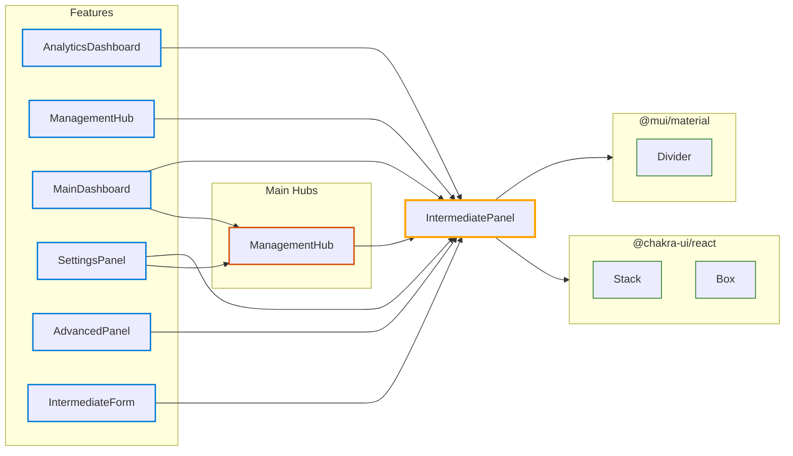

# Hub: IntermediatePanel

*Navigation: [Home](../index.md) | [Components](../components.md) | [Files](../files.md) | [Features](../features.md) | **Hubs***

## Hub Overview

- **Hub Type**: Base
- **Path**: [src/components/ui/IntermediatePanel.jsx](https://github.com/star4beam/react-import-analyzer/blob/main/test-project/src/components/ui/IntermediatePanel.jsx)
- **Used by Features**: 6
- **Total Dependency Paths**: 2
- **Packages Used**: @mui/material, @chakra-ui/react

## Hub Relationships Diagram

## Features Using This Hub

| Feature | Path |
|---------|------|
| [AnalyticsDashboard](../features/AnalyticsDashboard.md) | [src/components/analytics/AnalyticsDashboard.jsx](https://github.com/star4beam/react-import-analyzer/blob/main/test-project/src/components/analytics/AnalyticsDashboard.jsx) |
| [ManagementHub](../features/ManagementHub.md) | [src/components/composite/ManagementHub.jsx](https://github.com/star4beam/react-import-analyzer/blob/main/test-project/src/components/composite/ManagementHub.jsx) |
| [MainDashboard](../features/MainDashboard.md) | [src/components/dashboard/MainDashboard.jsx](https://github.com/star4beam/react-import-analyzer/blob/main/test-project/src/components/dashboard/MainDashboard.jsx) |
| [SettingsPanel](../features/SettingsPanel.md) | [src/components/settings/SettingsPanel.jsx](https://github.com/star4beam/react-import-analyzer/blob/main/test-project/src/components/settings/SettingsPanel.jsx) |
| [AdvancedPanel](../features/AdvancedPanel.md) | [src/components/ui/AdvancedPanel.jsx](https://github.com/star4beam/react-import-analyzer/blob/main/test-project/src/components/ui/AdvancedPanel.jsx) |
| [IntermediateForm](../features/IntermediateForm.md) | [src/components/ui/IntermediateForm.jsx](https://github.com/star4beam/react-import-analyzer/blob/main/test-project/src/components/ui/IntermediateForm.jsx) |

## Hubs Using This Hub

| Hub | Path | Dependency Type |
|-----|------|----------------|
| [ManagementHub](../hubs/ManagementHub.md) | [src/components/composite/ManagementHub.jsx](https://github.com/star4beam/react-import-analyzer/blob/main/test-project/src/components/composite/ManagementHub.jsx) | direct |

## Hubs This Hub Depends On

This hub does not depend on any other hubs.

## Components Used Indirectly

This section shows components used by other hubs that this hub depends on.

This hub does not use any components indirectly through other hubs.

## Components Used Directly

This section shows the components directly used by this hub from packages.

| Package | Components |
| ------- | ---------- |
| @chakra-ui/react | [Box](../components/@chakra-ui_react/Box.md), [Stack](../components/@chakra-ui_react/Stack.md) |
| @mui/material | [Divider](../components/@mui_material/Divider.md) |

